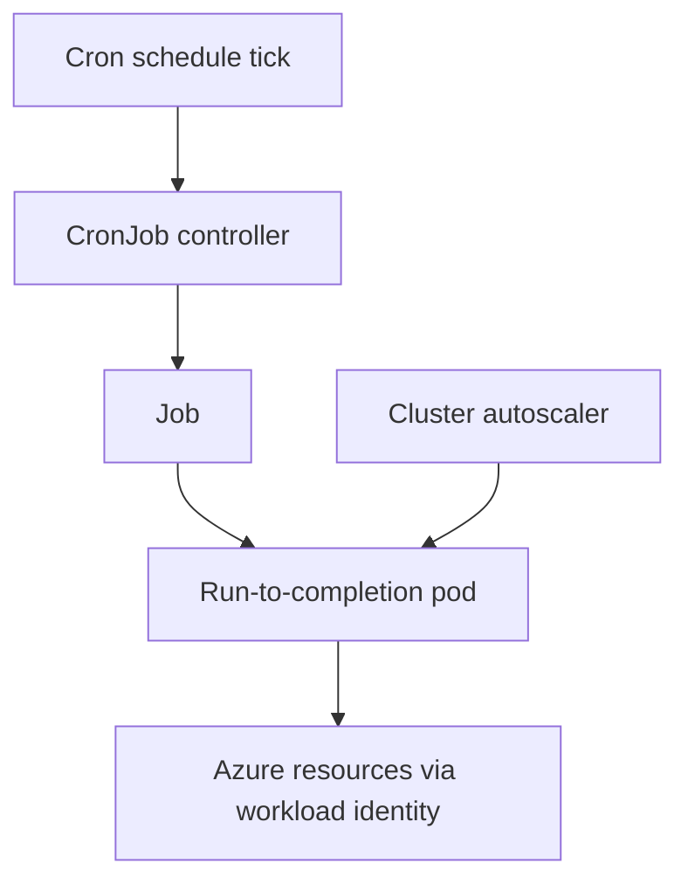

# CronJob (Scheduled Job)

Use this pattern for work that must run on a time schedule rather than continuously or on demand. The workload shape is defined by a recurring trigger, bounded execution, and completion semantics — not by a long-lived service or a backlog-driven consumer.

## When to Use

- Work runs on a fixed schedule such as nightly, hourly, or on a cron expression.
- Each run has a clear start, a bounded amount of work, and a completion state.
- Missing or delaying a run is tolerable within the schedule window.
- The task is batch-oriented: reports, cleanups, exports, reconciliation, or periodic maintenance.

Avoid this pattern when work arrives continuously from a queue, which is a [Background Worker](background-worker.md) concern, or when the task must serve synchronous callers, which is a stateless API or internal service concern.

## Deployment Shape

A CronJob creates a `Job` on each scheduled tick, and the `Job` creates one or more pods that run to completion. The controller distinction matters: unlike a `Deployment`, the desired end state is a finished pod, not a running one.

<!-- diagram-id: workload-guides-cronjob -->

Design the run for bounded, idempotent execution:

| Setting | Role | Guidance |
|---|---|---|
| `schedule` | When runs trigger | Use an explicit cron expression and confirm the cluster time zone assumption |
| `concurrencyPolicy` | Overlap behavior | Prefer `Forbid` or `Replace` unless overlapping runs are provably safe |
| `startingDeadlineSeconds` | Missed-run tolerance | Bound how late a missed run may still start |
| `backoffLimit` | Retry attempts per Job | Keep finite so a poison task does not retry forever |
| `successful/failedJobsHistoryLimit` | Job retention | Keep enough history for evidence without unbounded object growth |

Keep the authoritative record of work outside the pod so a failed or re-run job does not corrupt state.

## Scaling

Scheduled jobs scale by concurrency and parallelism within a run, not by steady replica count.

- Use a Job `parallelism` and `completions` model when a single run can be split into independent work items.
- Rely on the cluster autoscaler so scheduled bursts can obtain node capacity when many jobs fire at once.
- Stagger unrelated schedules so a single cron minute does not create a synchronized capacity spike.

The most common scaling surprise for this pattern is coincident schedules. Many jobs pinned to the same top-of-hour tick can overwhelm node capacity and downstream dependencies simultaneously.

## Probes and Health

Run-to-completion pods use health semantics differently from long-lived services.

- Liveness and readiness probes are usually unnecessary because the pod exits when work finishes.
- The primary health signal is the pod exit code and the resulting Job success or failure condition.
- Enforce an `activeDeadlineSeconds` so a stuck run terminates instead of holding capacity indefinitely.

Treat a non-zero exit and a hung run as different failures. A clean failure should surface through Job status and retries; a hang should be bounded by a deadline so it cannot silently block later runs under a `Forbid` concurrency policy.

## Networking

Most scheduled jobs do not need a Kubernetes Service because they are not called directly.

- Focus network design on egress reachability to the data sources, storage, or APIs the job touches.
- If the job calls private in-cluster services, use normal `ClusterIP` service discovery.
- Keep the job private unless an explicit callback or administrative endpoint is required.

Because this shape is egress-oriented and short-lived, network failures often present as failed or timed-out runs rather than as client-visible errors.

## Identity

Use Microsoft Entra Workload Identity for the job's Azure resource access. Scheduled jobs frequently touch storage, databases, or messaging on a recurring basis, so a scoped, federated identity is safer than a static secret that must be rotated across many runs.

- Assign a dedicated service account per job class when authorization boundaries differ.
- Scope Azure roles to the exact resource the run needs, not to a broad namespace-wide identity.
- Avoid embedding long-lived credentials in the job image or environment.

Use [Identity and Secrets](../platform/identity-and-secrets.md) for the implementation model. When federated authentication fails at run time, start with [Token Exchange Failure](../troubleshooting/playbooks/identity/token-exchange-failure.md).

## Observability

Observability for scheduled jobs must emphasize run outcomes over steady-state metrics.

Key signals:

- Job success and failure conditions per schedule
- run duration trend and whether it approaches the deadline
- pods left `Pending` at trigger time, indicating a capacity or scheduling constraint
- retry and backoff activity that hints at poison work
- Azure authorization failures during the run

Container Insights correlates pod and node context for each run. Pair it with the CronJob and Job object history so you can distinguish a schedule that never fired from a run that fired and failed.

## Failure Modes

| Symptom | Likely pattern failure | First place to look |
|---|---|---|
| runs never start | schedule, time zone assumption, or missed-run deadline too tight | CronJob spec, `startingDeadlineSeconds`, controller events |
| runs overlap and corrupt shared state | `concurrencyPolicy` allows overlap for a non-idempotent task | concurrency policy, job idempotency, external state model |
| job pods stay Pending at trigger time | synchronized schedules exhausted node capacity | pending pod reasons, cluster autoscaler status, schedule staggering |
| a bad run retries too many times | `backoffLimit` set too high for a poison task | Job spec, exit codes, poison-work handling |
| runs hang and block later schedules | no `activeDeadlineSeconds` under a `Forbid` policy | active deadline, run duration trend, controller events |

## See Also

- [Workload Guides](index.md)
- [Background Worker](background-worker.md)
- [Identity and Secrets](../platform/identity-and-secrets.md)
- [Node Pools](../platform/node-pools.md)
- [Reliability](../best-practices/reliability.md)
- [Operations](../operations/index.md)
- [PDB Drain Disruption Contract](../troubleshooting/playbooks/scheduling/pdb-drain-disruption-contract.md)
- [Token Exchange Failure](../troubleshooting/playbooks/identity/token-exchange-failure.md)

## Sources

- https://learn.microsoft.com/en-us/azure/aks/concepts-clusters-workloads
- https://learn.microsoft.com/en-us/azure/aks/cluster-autoscaler
- https://learn.microsoft.com/en-us/azure/aks/workload-identity-overview
- https://learn.microsoft.com/en-us/azure/azure-monitor/containers/container-insights-overview
