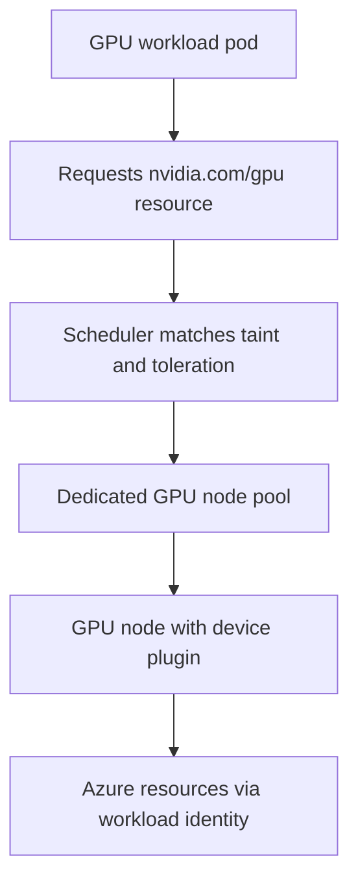

# GPU Workload (Overview)

Use this pattern for workloads that require GPU acceleration such as inference serving, training, media processing, or scientific compute. The defining constraints are specialized and expensive node capacity, strict scheduling requirements, and driver or device-plugin dependencies — not the request-serving shape of the application on top.

This is an overview of the workload shape. Treat GPU node pool sizing, driver management, and quota planning as first-class design work, not as defaults.

## When to Use

- The workload needs GPU compute that CPU nodes cannot provide.
- You can isolate GPU-bound pods onto dedicated GPU node pools.
- Cost control matters because GPU nodes are significantly more expensive than general-purpose nodes.
- The application can tolerate the scheduling and capacity limits that come with scarce accelerator hardware.

Avoid forcing GPU scheduling onto a shared general-purpose node pool. GPU capacity should be isolated so non-GPU workloads cannot consume or block it, and so GPU nodes scale independently.

## Deployment Shape

GPU workloads run as normal controllers — often a `Deployment` for inference or a `Job` for training — but they must be pinned to a GPU node pool and request the GPU resource explicitly.

<!-- diagram-id: workload-guides-gpu-workload -->

Key placement mechanics:

| Mechanism | Role | Guidance |
|---|---|---|
| Dedicated GPU node pool | Isolates accelerator capacity | Keep GPU nodes in their own pool so scaling and cost stay separate |
| Node taint + pod toleration | Repels non-GPU pods | Taint GPU nodes so only GPU workloads schedule there |
| `nvidia.com/gpu` resource limit | Reserves a GPU per pod | Set the GPU count under resource `limits` (Kubernetes copies it to `requests`) so the scheduler places the pod correctly |
| Node selector or affinity | Targets the right pool | Pin the workload to the GPU pool and to a compatible VM SKU |

Confirm the GPU driver and device plugin path for the cluster before deploying. Whether drivers are managed by the platform or installed by the workload changes both operations and troubleshooting.

## Scaling

GPU scaling is constrained by capacity and cost more than by request volume.

- Scale the GPU node pool deliberately; accelerator SKUs are scarce and expensive, so aggressive autoscaling can be costly or hit quota limits.
- Consider spot GPU node pools for interruptible batch or training work where eviction is acceptable.
- Right-size the GPU-to-pod ratio so a single pod does not idle an entire accelerator when it does not need the whole device.

Regional GPU SKU availability and subscription quota are real planning constraints. Validate both before assuming a GPU pool can scale up on demand.

## Probes and Health

Probe design depends on whether the workload serves requests or runs to completion.

- Inference serving still needs readiness and liveness probes to gate traffic and restart hung servers.
- Training jobs behave like batch work: bound them with a deadline and rely on completion state rather than request-path probes.
- Watch for GPU-specific failure signatures such as driver initialization errors or device-not-found conditions, which can leave a pod running but unable to use the accelerator.

A pod that is `Running` but cannot reach the GPU is a common and misleading state. Health checks should verify accelerator availability, not just process liveness, where practical.

## Networking

Networking follows the underlying serving or batch shape rather than anything GPU-specific.

- Inference services use the same ingress or internal service networking as any other served workload.
- Training and batch jobs are usually egress-oriented toward datasets and storage.
- Plan egress bandwidth for large dataset movement, which can dominate the cost and duration of a training run.

The accelerator does not change the network model; the data movement pattern around it often does.

## Identity

Use Microsoft Entra Workload Identity for the GPU workload's Azure access, especially for datasets in storage, model registries, or downstream services.

- Scope the identity to the exact storage or resource the workload reads and writes.
- Separate training identities from serving identities when their authorization boundaries differ.
- Avoid embedding credentials in large GPU images where they are harder to rotate and audit.

Use [Identity and Secrets](../platform/identity-and-secrets.md) for the implementation model, and [Token Exchange Failure](../troubleshooting/playbooks/identity/token-exchange-failure.md) when federated access fails.

## Observability

GPU observability must combine standard pod and node signals with accelerator-specific evidence.

Key signals:

- pods stuck `Pending` because no GPU node capacity is available
- GPU node pool size and scale activity against quota
- driver or device-plugin errors in pod and node events
- utilization evidence to detect idle-but-allocated GPUs wasting cost
- spot eviction activity when using interruptible GPU pools

Container Insights provides the cluster and node context. Pair it with accelerator utilization signals so you can separate a scheduling problem from a driver problem from a genuine capacity shortage.

## Failure Modes

| Symptom | Likely pattern failure | First place to look |
|---|---|---|
| GPU pods stay Pending | no GPU node capacity, quota exhausted, or missing toleration | pending pod reasons, node pool size, taint and toleration match |
| pod runs but cannot use the GPU | driver or device-plugin not ready, missing resource limit | node events, device plugin status, `nvidia.com/gpu` limit |
| non-GPU pods land on GPU nodes | GPU nodes not tainted | node taints, workload tolerations |
| GPU cost is unexpectedly high | idle-but-allocated accelerators or over-scaled pool | utilization signals, GPU-to-pod ratio, autoscaler bounds |
| training jobs die mid-run | spot eviction on an interruptible pool | eviction events, spot pool configuration, checkpointing model |

## See Also

- [Workload Guides](index.md)
- [Node Pools](../platform/node-pools.md)
- [Explicit Placement and Disruption Control](../best-practices/explicit-placement-disruption-control.md)
- [Cost Optimization](../best-practices/cost-optimization.md)
- [Identity and Secrets](../platform/identity-and-secrets.md)
- [Pending Pods](../troubleshooting/playbooks/pod-issues/pending-pods.md)
- [Spot Eviction Storm](../troubleshooting/playbooks/scaling/spot-eviction-storm.md)

## Sources

- https://learn.microsoft.com/en-us/azure/aks/gpu-cluster
- https://learn.microsoft.com/en-us/azure/aks/use-multiple-node-pools
- https://learn.microsoft.com/en-us/azure/aks/operator-best-practices-advanced-scheduler
- https://learn.microsoft.com/en-us/azure/azure-monitor/containers/container-insights-overview
