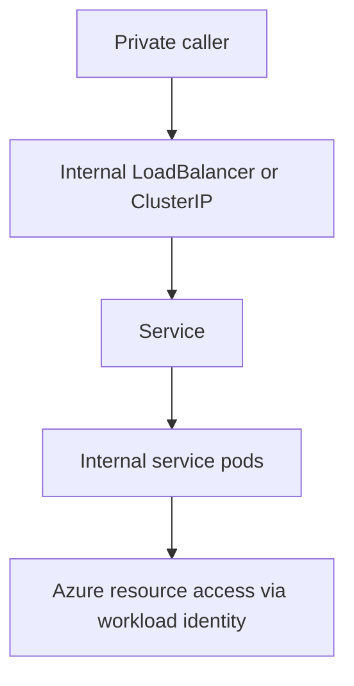

# Internal Service

Use this pattern for services that should stay private to the cluster, the virtual network, or a controlled internal consumer path. The workload still benefits from Kubernetes service discovery and replica management, but it should not be treated like a public web edge.

## When to Use

- The workload is called by other services inside the cluster.
- Consumers sit on a peered network, corporate network, or other private address space.
- You need a stable private endpoint but not a public internet entry point.
- The service carries back-end traffic such as internal APIs, adapters, or shared business services.

Avoid this pattern when the primary requirement is public HTTP exposure through Ingress. Also avoid it when the workload requires persistent storage identity, which is a stateful design concern rather than an internal connectivity concern.

## Deployment Shape

Most internal services still run as a `Deployment` behind a Kubernetes `Service`. The networking difference is whether callers stay entirely inside the cluster or need a private north-south entry point.

<!-- diagram-id: workload-guides-internal-service -->

Choose the exposure layer deliberately:

| Exposure choice | Best fit | Notes |
|---|---|---|
| `ClusterIP` | East-west traffic inside the cluster | Default choice for service-to-service communication |
| `LoadBalancer` with internal annotation | Private north-south traffic from inside the virtual network | AKS creates an Azure internal load balancer rather than a public one |

The workload controller remains the same. What changes is the service type and the private reachability boundary around it.

## Scaling

Internal services can scale horizontally, but the scale trigger is often less bursty than a public API.

- Use HPA when the service has independent demand characteristics and can add replicas safely.
- Keep request and limit values explicit so cluster scheduling and autoscaling remain predictable.
- Coordinate scale expectations with upstream callers; an internal service can still become the bottleneck for many workloads even though it is private.

This pattern often exposes hidden coupling. If every caller depends on one internal service, scaling and availability planning for that service should be treated as platform-critical, not as an afterthought.

## Probes and Health

Probe behavior controls whether internal callers see a healthy backend set.

- Readiness decides when the service is added to endpoints.
- Liveness should be conservative to avoid restart amplification across dependency graphs.

For internal services, readiness may need to include dependencies that are required for downstream correctness, such as configuration load or critical connection bootstrap. Keep that narrower than a full dependency matrix so one failing optional dependency does not black-hole the entire service.

If the service is behind an Azure internal load balancer, remember that the Kubernetes Service and pod readiness still determine which pods actually receive traffic.

## Networking

Networking is the defining choice for this workload shape.

- Use `ClusterIP` when every caller is already inside the cluster.
- Use an internal load balancer service when consumers need a private IP from inside the virtual network.
- Plan subnet size and routability according to the AKS networking model because Service exposure still depends on the cluster's underlying network design.

An internal load balancer on AKS is created by annotating a Kubernetes `Service` of type `LoadBalancer` so Azure provisions a private frontend instead of a public one. This is the right pattern for private north-south traffic, not for purely in-cluster service discovery.

Private exposure is not an access-control boundary. A `ClusterIP` or internal IP restricts *where* the service can be reached from, not *which* pods may connect to it. By default any pod in the cluster can reach any Service. Constrain east-west traffic explicitly with Kubernetes `NetworkPolicy` (or Cilium/Azure network policy, depending on your CNI) so only the intended caller pods and namespaces can open connections to this service. Adopt a default-deny posture per namespace and allow specific caller identities rather than relying on the private IP alone.

## Identity

Private connectivity does not remove the need for strong workload identity. Internal services still call Azure resources and should still use Microsoft Entra Workload Identity as the recommended pattern.

Use separate service accounts for services with different authorization boundaries. Private traffic and private IPs are not substitutes for identity scoping.

Workload identity covers *workload-to-Azure* authentication. It does not authenticate *caller-to-callee* traffic between two services inside the cluster. Network reachability (`ClusterIP`, private IP) is not caller authentication: any pod that can reach the service can call it unless the application enforces its own identity check. For east-west (service-to-service) auth, add an application-layer mechanism appropriate to your trust requirements — for example mutual TLS, signed tokens validated by the callee, or a service mesh / gateway that mediates and authenticates internal calls. Pair that app-layer auth with `NetworkPolicy` so that reachability and identity are both constrained.

For the implementation model, use [Identity and Secrets](../platform/identity-and-secrets.md). When federation is configured incorrectly, start with [Token Exchange Failure](../troubleshooting/playbooks/identity/token-exchange-failure.md) or [Audience Mismatch](../troubleshooting/playbooks/identity/audience-mismatch.md).

## Observability

Observability for internal services should emphasize dependency health and request path evidence rather than public endpoint checks.

Key signals:

- ready endpoint count for the Service
- restart count and probe failures
- latency and error rates between caller and callee
- internal load balancer health when the service is privately exposed beyond the cluster
- Azure resource authorization failures when the service uses workload identity

Container Insights helps correlate pod behavior, controller state, and node conditions. Pair it with targeted caller-side logs so you can tell whether the failure is in the service itself, the private network path, or the downstream dependency.

## Failure Modes

| Symptom | Likely pattern failure | First place to look |
|---|---|---|
| callers cannot resolve or reach the service | wrong service type, DNS issue, or network policy block | Service spec, DNS behavior, network policy |
| internal load balancer exists but traffic fails | wrong annotation, unhealthy backends, or subnet routing assumption | Service annotations, endpoints, private IP reachability |
| service is private but still over-permissioned | shared identity across multiple workloads | service account mapping, Azure role scope |
| cascading outage across several apps | internal dependency was treated as low criticality | ready replicas, caller retries, scaling limits |
| intermittent 401 or 403 to Azure dependencies | federated token exchange or authorization mismatch | workload identity config, token exchange playbooks |

## See Also

- [Workload Guides](index.md)
- [Identity and Secrets](../platform/identity-and-secrets.md)
- [Networking Models](../platform/networking-models.md)
- [Security](../best-practices/security.md)
- [Operations](../operations/index.md)
- [Audience Mismatch](../troubleshooting/playbooks/identity/audience-mismatch.md)
- [Token Exchange Failure](../troubleshooting/playbooks/identity/token-exchange-failure.md)
- [Service Unreachable](../troubleshooting/playbooks/connectivity/service-unreachable.md)

## Sources

- https://learn.microsoft.com/en-us/azure/aks/internal-lb
- https://learn.microsoft.com/en-us/azure/aks/concepts-network
- https://learn.microsoft.com/en-us/azure/aks/workload-identity-overview
- https://learn.microsoft.com/en-us/azure/aks/concepts-clusters-workloads
- https://learn.microsoft.com/en-us/azure/aks/use-network-policies
