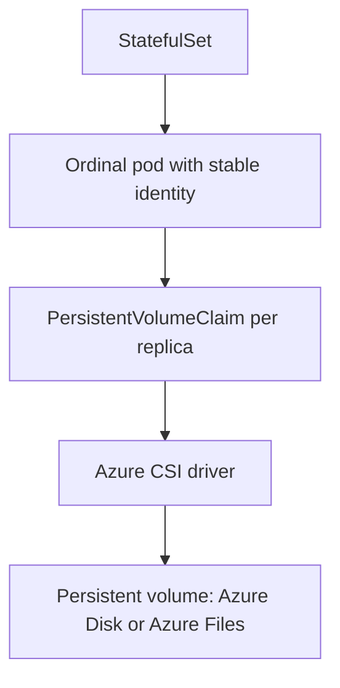

# Stateful Workload Considerations

Use this pattern when replicas are not interchangeable — each one owns durable state, a stable identity, or an ordered position. The defining constraints are persistent storage, stable network identity, and careful disruption handling, which make stateful workloads fundamentally different from the stateless shapes in this section.

This guide covers the considerations that change when state is involved. Most other patterns here assume interchangeable replicas; this one does not.

## When to Use

- Each replica owns its own durable data that must survive pod restarts and rescheduling.
- Replicas need stable, predictable network identities and ordered startup or shutdown.
- The workload is a database, cache with persistence, message broker, or similar stateful system.
- Losing or reordering a replica has correctness consequences, not just capacity consequences.

Prefer a managed Azure data service when one fits. Run stateful workloads on AKS when you specifically need in-cluster control, a Kubernetes-native operator, or a system that has no suitable managed equivalent.

## Deployment Shape

Stateful workloads typically run as a `StatefulSet`, which gives each replica a stable ordinal identity and a dedicated `PersistentVolumeClaim` through a volume claim template. Storage attaches per replica rather than being shared arbitrarily.

<!-- diagram-id: workload-guides-stateful-workload -->

Key mechanics:

| Mechanism | Role | Guidance |
|---|---|---|
| `StatefulSet` | Stable identity and ordering | Use when replicas are not interchangeable |
| Volume claim template | Per-replica persistent storage | Each ordinal gets its own PVC and volume |
| CSI driver (Disk or Files) | Backs volumes with Azure storage | Azure Disk for single-writer, Azure Files for shared access |
| Headless Service | Stable per-pod DNS | Enables clients to address individual replicas |

Choose the storage class deliberately. Azure Disk is single-node read-write and fits per-replica data; Azure Files supports shared multi-node access. The wrong choice surfaces as attach or mount failures during scheduling.

## Scaling

Stateful scaling is bounded by data ownership and rebalancing, not by simple replica count.

- Scale with awareness of ordering: a `StatefulSet` creates and deletes pods in ordinal sequence by default.
- Understand what scaling means for the application's data — adding a replica often requires data rebalancing or replication catch-up.
- Do not treat scale-in as free; removing a replica may strand or require draining its volume and data.

Horizontal scale for stateful systems is an application-level concern first and a Kubernetes concern second. The controller manages pods and volumes, but it does not rebalance your data for you.

## Probes and Health

Health semantics must reflect data readiness, not just process liveness.

- Readiness should signal when a replica has loaded state and can safely serve or participate in the cluster quorum.
- Liveness must be conservative — an aggressive liveness probe that restarts a busy stateful replica can trigger recovery storms or split-brain risk.
- Account for slow, legitimate startup such as data replay, warm-up, or replication sync before marking a replica ready.

For clustered stateful systems, premature readiness or over-eager restarts are more dangerous than a slightly delayed one. Tune probes to the data lifecycle, not to a stateless request cycle.

## Networking

Stateful workloads usually need stable, individually addressable identities.

- Use a headless Service so each replica gets stable DNS for direct addressing and peer discovery.
- Keep the workload private unless there is an explicit external access requirement.
- Preserve identity stability across rescheduling so peers and clients can reconnect predictably.

Unlike stateless services behind a single virtual IP, stateful clustering often depends on each replica being reachable by its own stable name.

## Identity

Use Microsoft Entra Workload Identity for the stateful workload's Azure access, such as backup targets, storage, or key material.

- Scope the identity to the exact resources the workload uses for persistence and backup.
- Keep identity per workload class so a shared credential does not span unrelated stateful systems.
- Avoid static secrets for storage and backup access where a federated identity can be used instead.

Use [Identity and Secrets](../platform/identity-and-secrets.md) for the implementation model, and [Token Exchange Failure](../troubleshooting/playbooks/identity/token-exchange-failure.md) when federated access fails.

## Observability

Stateful observability must include storage and disruption evidence, not only pod state.

Key signals:

- PVC binding state and volume attach or mount errors
- rolling-update progress, since a stuck stateful rollout can halt on a single ordinal
- disruption and drain events against the pod disruption budget
- replication or quorum health at the application level
- volume capacity trend and expansion needs

Container Insights gives cluster and pod context. Pair it with storage events and application-level cluster health so you can separate a volume problem from a scheduling problem from an application replication problem.

## Failure Modes

| Symptom | Likely pattern failure | First place to look |
|---|---|---|
| pod stuck Pending with an unbound PVC | storage class mismatch or capacity or zone constraint | PVC status, storage class, zone alignment |
| volume fails to attach or mount | wrong access mode, disk single-writer contention, or node placement | attach and mount events, Disk vs Files choice, node topology |
| rolling update stalls partway | one ordinal cannot become ready, blocking the sequence | StatefulSet rollout status, per-replica readiness, data replay time |
| data loss or corruption after rescheduling | ephemeral storage used where persistence was required | volume claim template, storage class, persistence configuration |
| drains blocked or unsafe | disruption budget or quorum not respected during node operations | pod disruption budget, drain events, application quorum state |

## See Also

- [Workload Guides](index.md)
- [Storage Options](../platform/storage-options.md)
- [Explicit Placement and Disruption Control](../best-practices/explicit-placement-disruption-control.md)
- [Reliability](../best-practices/reliability.md)
- [Identity and Secrets](../platform/identity-and-secrets.md)
- [PVC Stuck Pending](../troubleshooting/playbooks/storage/pvc-stuck-pending.md)
- [Volume Attach Failure](../troubleshooting/playbooks/storage/volume-attach-failure.md)
- [StatefulSet Stuck Rolling Update](../troubleshooting/playbooks/storage/statefulset-stuck-rolling-update.md)

## Sources

- https://learn.microsoft.com/en-us/azure/aks/concepts-storage
- https://learn.microsoft.com/en-us/azure/aks/operator-best-practices-storage
- https://learn.microsoft.com/en-us/azure/aks/azure-csi-disk-storage-provision
- https://learn.microsoft.com/en-us/azure/azure-monitor/containers/container-insights-overview
