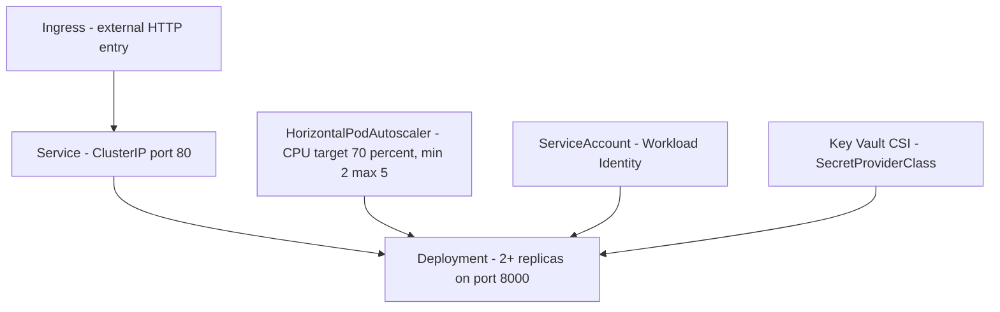

# Stateless Web API on AKS

Use this pattern when you need an externally reachable HTTP API that can scale horizontally without session affinity or per-replica state. This guide maps that shape to the existing `apps/python/` FastAPI sample and its manifests under `apps/python/manifests/`.

<!-- diagram-id: workload-guides-stateless-web-api-on-aks-architecture -->

## Deployment Shape

This sample uses a Kubernetes `Deployment`, which is the normal fit for a stateless HTTP API because replicas are interchangeable and can be replaced during rollouts without preserving pod identity.

- `apps/python/manifests/deployment.yaml` sets `replicas: 2` so the API starts with more than one replica for baseline availability.
- The pod-level `securityContext` runs the container as non-root with `runAsUser: 1000`, `runAsGroup: 1000`, and `seccompProfile.type: RuntimeDefault`.
- The container-level `securityContext` disables privilege escalation, drops `ALL` capabilities, and enables `readOnlyRootFilesystem: true`.
- Resource requests and limits are sized for a small API footprint: `100m`/`128Mi` requested and `250m`/`256Mi` limited.
- A writable `emptyDir` mounted at `/tmp` keeps the root filesystem read-only while still allowing temporary file use.

For this workload shape, use `Deployment` rather than `StatefulSet` because the app does not rely on stable pod names, attached persistent volumes, or ordered identity.

## Scaling

The sample scales with `autoscaling/v2` HorizontalPodAutoscaler in `apps/python/manifests/hpa.yaml`.

- Target: `Deployment/keyvault-app`
- Metric: CPU utilization
- Threshold: `averageUtilization: 70`
- Bounds: `minReplicas: 2`, `maxReplicas: 5`

That makes sense for a stateless web API because new replicas can accept traffic immediately after they pass readiness. If you later need event-driven scaling instead of request-driven or CPU-driven scaling, evaluate KEDA as the next pattern rather than stretching HPA beyond its intended inputs.

## Health Probes

The FastAPI app exposes both health endpoints needed by the Deployment:

- `/healthz` returns `{"status":"ok"}` for liveness.
- `/readyz` returns `{"status":"ready"}` for readiness.

The manifest configures them as separate HTTP probes:

- **Liveness probe**: `GET /healthz`, `initialDelaySeconds: 10`, `periodSeconds: 10`
- **Readiness probe**: `GET /readyz`, `initialDelaySeconds: 5`, `periodSeconds: 10`

Readiness is the more important gate for this traffic shape because Kubernetes only publishes ready pods behind the Service. If readiness never succeeds, Ingress still exists, but requests have no healthy backend endpoints to reach.

## Networking

The sample uses a layered exposure model that matches a public stateless API:

- `service.yaml` defines a `ClusterIP` Service on port `80` targeting the named container port `http` on `8000`.
- `ingress.yaml` exposes the Service through an Ingress rule for the `/` path on the configured hostname.
- The Ingress class annotation targets the AKS web application routing controller: `webapprouting.kubernetes.azure.com`.

Keep this separation even for simple APIs. Pods should not be exposed directly. Use `ClusterIP` for in-cluster discovery, then add Ingress only when the workload needs external HTTP or HTTPS access. For internal-only services, stop at `ClusterIP` and omit the Ingress layer.

## Identity

The workload uses Microsoft Entra Workload Identity instead of embedding credentials in the pod.

- `serviceaccount.yaml` annotates the `keyvault-reader` ServiceAccount with `azure.workload.identity/client-id`.
- The Deployment labels pods with `azure.workload.identity/use: "true"` and sets `serviceAccountName: keyvault-reader`.
- `secretproviderclass.yaml` points the Azure Key Vault provider at the same user-assigned managed identity and mounts the `app-secret` value through the Secrets Store CSI Driver.

Use the full identity setup from [Python on AKS](../language-guides/python-on-aks.md) for federation and role assignment details. The important workload-pattern decision is that secret access stays externalized: the pod gets a federated token, and the secret is mounted at runtime rather than stored in the image or a plain manifest.

## Observability

For a stateless API, watch both request behavior and replica behavior.

- Use `kubectl logs` for immediate pod-level troubleshooting during rollout or incident response.
- Use Container Insights and Azure Monitor for cluster and workload metrics such as CPU, memory, restart counts, and controller health.
- Query Log Analytics tables such as `ContainerLogV2` and `KubeEvents` when you need historical evidence beyond the current pod lifetime.

Key signals to watch for this shape:

- 5xx rate or request failure spikes at the ingress or application layer
- p95 latency increases under load
- HPA replica count pinned at minimum or maximum
- probe failures, restart counts, or `OOMKilled` terminations

## Failure Modes

| Symptom | Likely cause | Where to look |
|---|---|---|
| Pods never become Ready | Secret mount issue, dependency initialization problem, or readiness path mismatch | `kubectl describe pod`, `kubectl logs`, `KubeEvents`, `ContainerLogV2` |
| 5xx spikes after rollout | Resource limits too tight, application regression, or secret-dependent code path failing | `kubectl logs`, Container Insights metrics, [Pod CrashLoopBackOff](../troubleshooting/playbooks/pod-crashloopbackoff.md) |
| No scale-up during load | Metrics pipeline problem, HPA target mismatch, or resource requests not reflecting actual bottleneck | `kubectl describe hpa`, `kubectl top pods`, Azure Monitor metrics |
| `CrashLoopBackOff` | Image startup failure, failed probe, or secret/config dependency missing | [Pod CrashLoopBackOff](../troubleshooting/playbooks/pod-crashloopbackoff.md) |
| Hostname returns 404, 502, or timeout | Ingress class mismatch, backend service wiring issue, or unhealthy endpoints | [Ingress Not Working](../troubleshooting/playbooks/ingress-not-working.md) |

## See Also

- [Python on AKS](../language-guides/python-on-aks.md)
- [Identity and Secrets](../platform/identity-and-secrets.md)
- [Monitoring and Logging](../operations/monitoring-logging.md)
- [Best Practices](../best-practices/index.md)

## Sources

- https://learn.microsoft.com/en-us/azure/aks/concepts-clusters-workloads
- https://learn.microsoft.com/en-us/azure/aks/concepts-network-ingress
- https://learn.microsoft.com/en-us/azure/aks/concepts-scale
- https://learn.microsoft.com/en-us/azure/aks/best-practices-app-cluster-reliability
- https://learn.microsoft.com/en-us/azure/aks/workload-identity-deploy-cluster
- https://learn.microsoft.com/en-us/azure/aks/csi-secrets-store-driver
- https://learn.microsoft.com/en-us/azure/aks/monitor-aks
- https://learn.microsoft.com/en-us/azure/azure-monitor/containers/container-insights-overview
